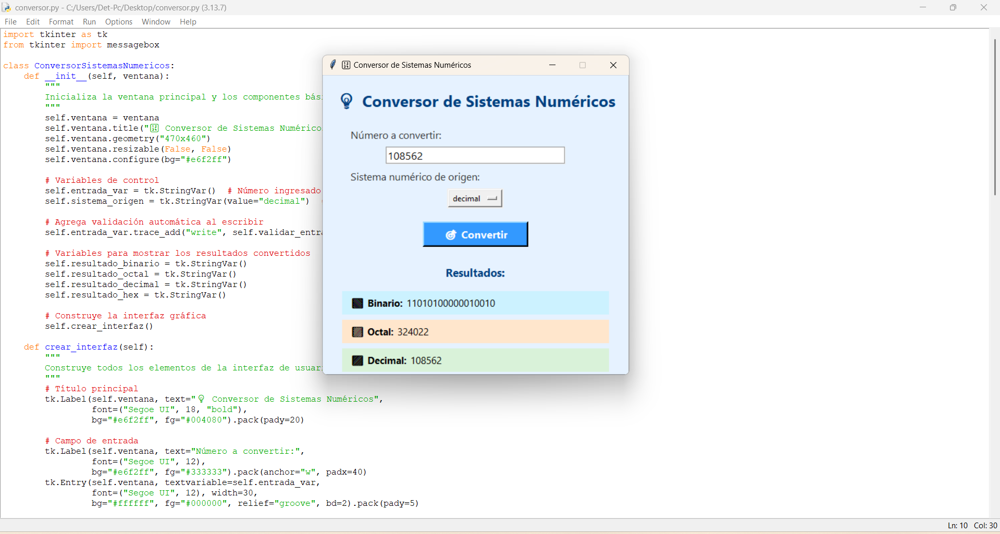
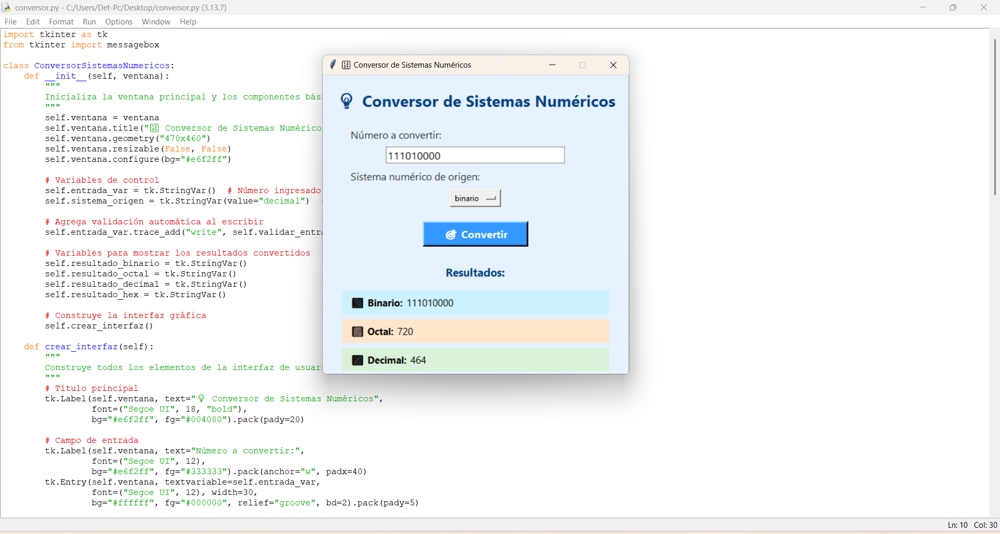
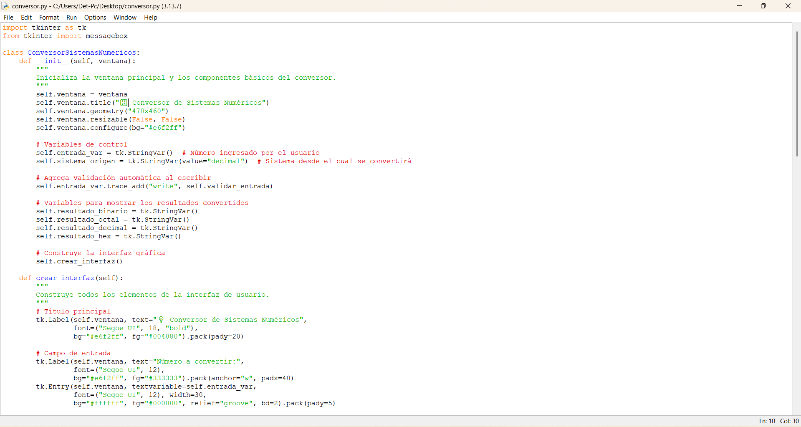
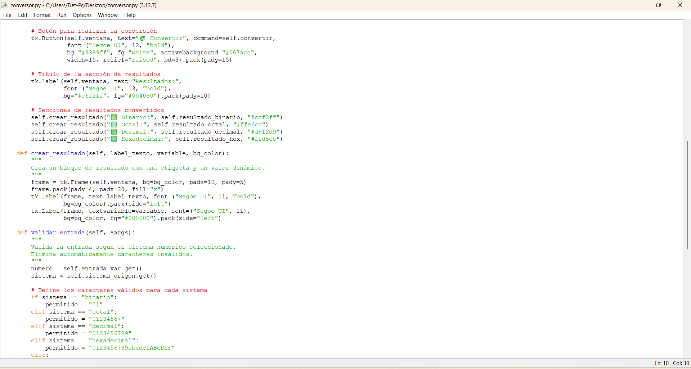
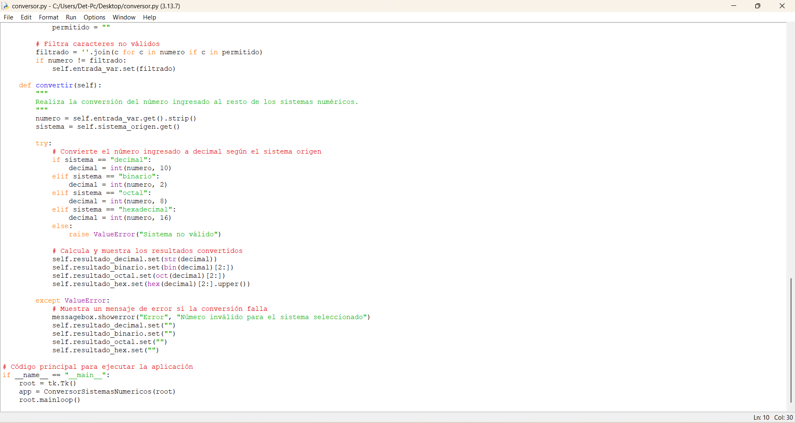

# 🔢 Conversor de Sistemas Numéricos

## Descripción

Este proyecto es un conversor gráfico de sistemas numéricos que permite convertir un número ingresado entre diferentes bases: binario, octal, decimal y hexadecimal. Es una herramienta útil para estudiantes y desarrolladores que trabajan con sistemas de numeración diferentes al sistema decimal.

---
## 🎯 Objetivos Generales

1. Desarrollar una aplicación de escritorio que permita convertir números entre los diferentes sistemas de numeración: binario, octal, decimal y hexadecimal.
2. Aplicar conceptos teóricos de sistemas numéricos mediante el desarrollo práctico de una herramienta interactiva.
3. Fomentar el aprendizaje de interfaces gráficas en Python, utilizando la librería Tkinter como medio de interacción con el usuario.
4. Mejorar la comprensión de la lógica de conversión numérica, integrando validación de datos y retroalimentación visual en tiempo real.

- Desarrollar una aplicación gráfica que permita la conversión entre diferentes sistemas numéricos.
- Facilitar el aprendizaje y comprensión de los sistemas binario, octal, decimal y hexadecimal.
- Proveer una herramienta práctica para estudiantes y profesionales en informática y electrónica.

---

## 📘 Sistemas Numéricos

### 📚 Sistema Binario
El sistema binario es un sistema de numeración en base 2 que utiliza únicamente dos dígitos: 0 y 1. Es la base fundamental del funcionamiento de los computadores, ya que estos operan internamente con señales eléctricas que representan estos dos estados (encendido y apagado).

| Decimal | Binario |
|---------|---------|
| 5       | 101     |
| 10      | 1010    |
| 15      | 1111    |

---

### 📚 Sistema Octal
El sistema octal es un sistema de numeración en base 8, que utiliza los dígitos del 0 al 7. Es una forma compacta de representar números binarios, ya que cada dígito octal corresponde exactamente a tres bits en binario.

| Decimal | Octal |
|---------|-------|
| 8       | 10    |
| 10      | 12    |
| 64      | 100   |

---

### 📚 Sistema Decimal
El sistema decimal es el sistema numérico más común y cotidiano, basado en la base 10. Utiliza diez dígitos (del 0 al 9) y es el sistema que empleamos para contar y realizar operaciones matemáticas en la vida diaria.

| Decimal |
|---------|
| 5       |
| 10      |
| 15      |

---

### 📚 Sistema Hexadecimal
El sistema hexadecimal es un sistema de numeración en base 16, que utiliza dieciséis símbolos para representar valores: los dígitos del 0 al 9 y las letras de la A a la F (que representan los valores del 10 al 15). Es ampliamente utilizado en informática para simplificar la representación de valores binarios largos.

| Decimal | Hexadecimal |
|---------|-------------|
| 10      | A           |
| 15      | F           |
| 255     | FF          |

---

## 🚀 Uso

1. Ingrese el número que desea convertir en el campo "Número a convertir".
2. Seleccione el sistema numérico de origen (binario, octal, decimal, hexadecimal).
3. Presione el botón **Convertir** para obtener los resultados en los demás sistemas numéricos.

---

## 🛠️ Tecnologías Utilizadas

- Python
- Tkinter para la interfaz gráfica

---

## 🖼️ Imagenes

## 🖼️ Imagenes del codigo

¡Gracias por usar el Conversor de Sistemas Numéricos!
